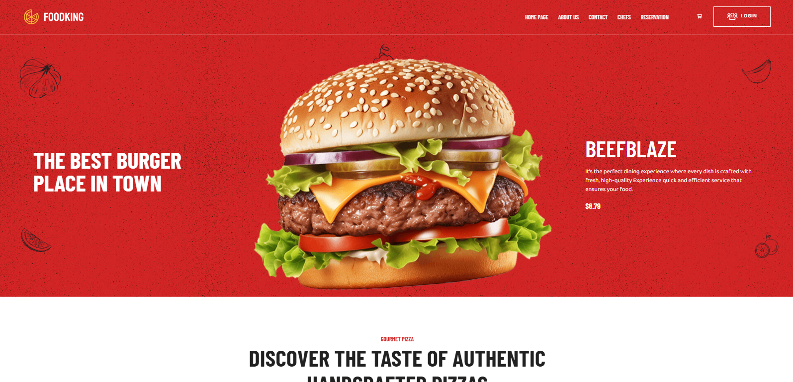
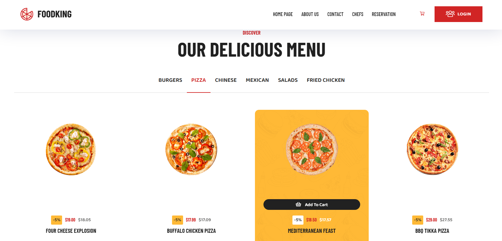
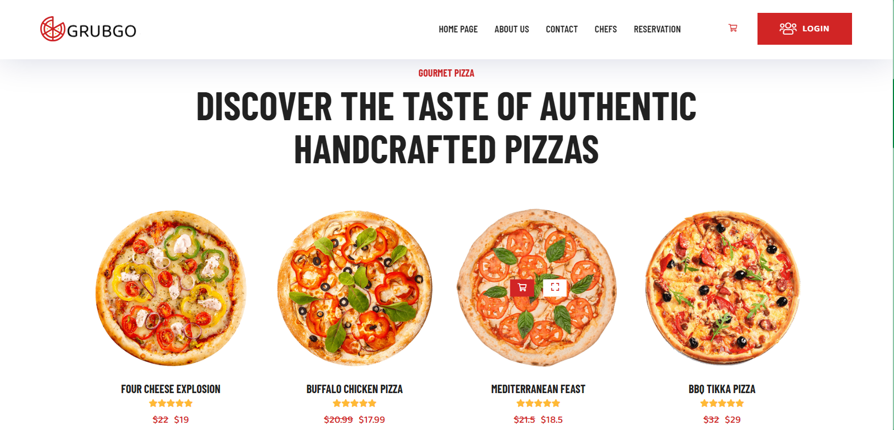

# 🍽️ GrubGo - Online Food Delivery System

A full-featured **MERN stack** food ordering platform with user and admin interfaces. It allows restaurants to manage menus, process online orders, and handle payments through Stripe integration.

---

## 🚀 Features

- Role-based authentication (User/Admin)
- Browse menu items and place orders
- Stripe payment integration (Card/Cash)
- Admin panel for managing items, users, and orders
- Order tracking and history
- Fully responsive UI (desktop & mobile)

---

## 🛠 Tech Stack

- **Frontend:** React.js, Bootstrap, Axios  
- **Backend:** Node.js, Express.js  
- **Database:** MongoDB Atlas (Cloud)  
- **Payment:** Stripe API  

---

## 📫 Contact

**Fakhir Zeeshan**  
📍 Queens, NY  
📧 fakhirzeeshan02@gmail.com  
🔗 [LinkedIn](https://www.linkedin.com/in/fakhirzeeshan)

---

## 📸 Screenshots






---

## 🧪 Getting Started

To run this project locally using MongoDB Atlas:

### 1. Clone the Repository

```bash
git clone https://github.com/fakhirzeeshan/online-food-delivery-system.git

### 3. Set Up Environment Variables

You’ll need to add your own `.env` file in the `/server` directory to connect the backend to MongoDB Atlas.

Create a file named `.env` and add the following:

```env
MONGODB_URI=your-mongodb-atlas-connection-uri
PORT=5000

Installation Instructions

To run this project locally, follow these steps:

1. Clone or download the repository
2. Install dependencies

For backend:

cd server
npm install

For frontend:

cd client
npm install

3. Run the project

Start backend:

npm run server

Start frontend:

cd client
npm start

Note: The node_modules folder is not included in the submission to reduce file size. Please install dependencies using npm install before running the project.
